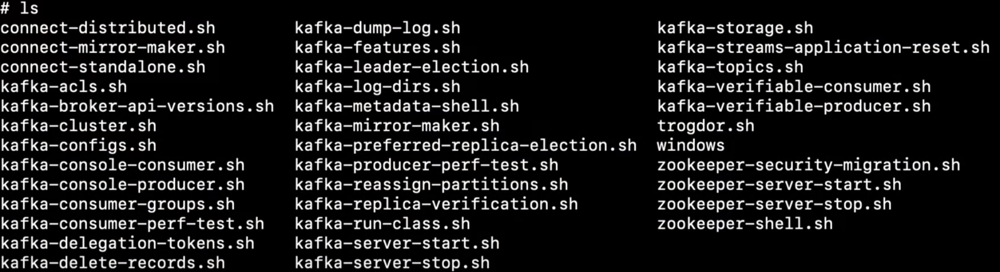

# Kafka in Docker

As refereed previously, the chosen method to package this system is in Docker. Please make sure you have it installed and follow this tutorial:

# Operating Docker

In the following section wi'll be approaching on how to operate the Docker environment.

## Launch kafka in docker

All of Kafka services (Beekeper, Kafdrop) need to be located in the same network as Kafka, so the default network mode of containers isn't possible (Bridge), which blocks connection with other containers. So we proceed to create a shared network between kafka components, but also the Ditto service present in the other services. To create the shared docker network, execute the command:

```bash
docker network create kafka-network
```

Next, use the script `build.sh` which will create the necessary containers and inititate kafka. If you're in Linux, the command is:

```bash
sh ./build.sh
```

After the custom containers are created and the system is running, wait a few seconds and access the Kadrop Web Ui management, located at `localhost:9007`. Here it's possible to see information about the kafka custer and created topics.

Forn other initiations of kafka, the same command can be used or simply:

```bash
docker compose up -d
```

## Stop Kafka in docker

To stop the execution of kafka, simply run:

```bash
docker compose down
```

Or to stop and remove the custom create containers, run:

```bash
sh ./purge.sh
```

## Launch a consumer in a docker environment

A Kafka consumer can be launched to view messages in a topic (it's recommended to use *KafDrop* web monitoring tool). It can be launched using the following command:

```bash
# In production environment
docker run -it --rm confluentinc/cp-kafka /bin/kafka-console-consumer --bootstrap-server <HOST_IP_ADDRESS>:29092 --topic <TOPIC>

# In development environment
docker run --rm --network=host confluentinc/cp-kafka:6.2.0 kafka-console-consumer --bootstrap-server localhost:9092 --topic <TOPIC>
```

* Flag `--from-beginning` can be used to obtain all messages sent to the system


## Launch a producer in a docker environment

A Kafka producer can be launched to produce messages into a topic. This is a good addition when we want to test Kafka streams latter on. It can be launched using the following command:

```bash
# In production environment
docker run -it --rm confluentinc/cp-kafka /bin/kafka-console-producer --bootstrap-server <HOST_IP_ADDRESS>:29092 --topic <TOPIC>

# In development environment
docker run -it --rm --network=host confluentinc/cp-kafka /bin/kafka-console-producer --bootstrap-server localhost:9092 --topic <TOPIC>
```

## Create a topic

A temporary topic can be created to make some testing scenarios, for that use the following command:

```bash
# In production environment
docker run -it --rm confluentinc/cp-kafka /bin/kafka-topics --create --topic <TOPIC> --bootstrap-server <HOST_IP_ADDRESS>:29092

# In development environment
docker run -it --rm --network=host confluentinc/cp-kafka /bin/kafka-topics --create --topic hello-world --bootstrap-server localhost:9092
```

However, when the containers are dismounted, this data is lost. To make it persistent, duplicate the command (with necessary changes) around lines 60 of the `docker-compose.yml` file and add it's check on the `applications/check_topics.sh` file.

## Other programs

Using the above docker commands, kafka offers a variety of applications to execute, as can be observed in the following image:



# Kafka Streams

Kafka Streams is a powerful library in Apache Kafka that allows developers to build real-time streaming applications. It provides a high-level API for processing and analyzing data streams in a scalable and fault-tolerant manner. With Kafka Streams, developers can easily transform, aggregate, and join data streams, enabling them to build applications that react to events in real-time. It integrates seamlessly with the Kafka ecosystem, leveraging its distributed messaging system and fault-tolerant storage. Kafka Streams is an ideal choice for building applications such as real-time analytics, fraud detection, recommendation systems, and more. 

In our case, we built a streams application located in `applications/PlateRecognizer.java`, that is compiled into a docker container and joined into the Kafka cluster automatically uppon building kafka. In any case, the next section will explain how to create the Maven project, compile, build and use the Streams.

## Building and Operating the Kafka-stream standalone

Make sure Maven is installed and execute the following command:

```bash
mvn archetype:generate \
    -DarchetypeGroupId=org.apache.kafka \
    -DarchetypeArtifactId=streams-quickstart-java \
    -DarchetypeVersion=3.7.0 \
    -DgroupId=streams.applications \
    -DartifactId=kafka-streams\
    -Dversion=0.1 \
    -Dpackage=applications
```

Be carefull with the examples generated at `src/main/java/applications/*.java`, since it's the directory where the stream applications will reside, so eliminate if you don't need them.

### Compile

To compile the Maven project with the Streams, use the following command:

```bash
mvn clean package
```

If there are dependency issues, the `add_nvm_dependency.sh` script can be used.

### Run app

To run the app, use the command: 

```bash
mnv exec:java -Dexec.mainClass=applications.<app_name>
```

### Compile container

Packaging the application into a docker container can be done using the provided `Dockerfile`'s. Use the following command to build the container:

```bash
docker build -t plate-recognizer_stream:1.0 --no-cache=true .
```

### Run container

To run a container, use the command:

```bash
docker run -it --user=root --network=kafka-network plate-recognizer_stream:1.0 /bin/bash
```

### Delete container

To delete a container, use the command:

```bash
docker image rm -f plate-recognizer_stream:1.0
```

# WordCount Stream application

## Launch Consumer

```bash
docker run --rm --network=host confluentinc/cp-kafka:6.2.0 /bin/kafka-console-consumer --bootstrap-server localhost:9092  --topic streams-wordcount-output --from-beginning --formatter kafka.tools.DefaultMessageFormatter --property print.key=true --property print.value=true --property key.deserializer=org.apache.kafka.common.serialization.StringDeserializer --property value.deserializer=org.apache.kafka.common.serialization.LongDeserializer
```

### Example Payload

```json
{"topic":"org.eclipse.ditto/c5ae6b75-3da1-4cd3-b0c5-ff22fa509233/things/twin/events/modified","headers":{"mqtt.retain":"false","mqtt.topic":"plate-reader/org.eclipse.ditto:c5ae6b75-3da1-4cd3-b0c5-ff22fa509233/uplink","mqtt.qos":"0","ditto-originator":"nginx:ditto","response-required":false,"version":2,"requested-acks":[],"content-type":"application/json","correlation-id":"ed3fff1b-3fff-4342-ada5-cfe89eaecfb4"},"path":"/features","value":{"imageCaptured":{"properties":{"timestamp":{"value":"2024-04-10T23:47:15+0100"},"imageId":{"properties":{"value":85635070}},"url":{"properties":{"value":"http://192.168.60.221:80/images?id=85635070"}}}}},"extra":{"thingId":"org.eclipse.ditto:c5ae6b75-3da1-4cd3-b0c5-ff22fa509233","features":{"imageCaptured":{"properties":{"timestamp":{"value":"2024-04-10T23:47:15+0100"},"imageId":{"properties":{"value":85635070}},"url":{"properties":{"value":"http://192.168.60.221:80/images?id=85635070"}}}}}},"revision":1878,"timestamp":"2024-04-10T22:47:15.648650832Z"}
```

## Launch Producer

```bash
docker run -it --rm --network=host confluentinc/cp-kafka /bin/kafka-console-producer --bootstrap-server localhost:9092 --topic streams-plaintext-input

docker run -it --rm --network=host confluentinc/cp-kafka /bin/kafka-console-producer --bootstrap-server localhost:9092 --topic imageCaptured
```

## PlateRecognizer Stream application

The aim of the PlateRecognizer Stream application is to consume data from the `imageCaptured` topic, containing information about the image, use the URL to retrive it, publish th image into the [Plate Recognizer](https://platerecognizer.com/) platform and in case license a plate was detected, publish it's data in the `plateRecognized` topic.

### Launch Consumer

In this case, a Consumer isn't necesseray, but one can be launcher using the command:
```bash
docker run --rm --network=host confluentinc/cp-kafka:6.2.0 /bin/kafka-console-consumer --bootstrap-server localhost:9092 --topic plateRecognized --from-beginning --property print.value=true --property key.deserializer=org.apache.kafka.common.serialization.StringDeserializer --property value.deserializer=org.apache.kafka.common.serialization.StringDeserializer
```

### Launch Producer

Without using the Plate-Recognizer module, for offline testing, an example payload can be inserted into the topic. To start the producer, use the command:

```bash
docker run -it --rm --network=host confluentinc/cp-kafka /bin/kafka-console-producer --bootstrap-server localhost:9092 --topic imageCaptured
```

#### Example Payload

Here is an example message sent by Ditto, posted to the `imageCaptured` topic.

```json
{"topic":"org.eclipse.ditto/c5ae6b75-3da1-4cd3-b0c5-ff22fa509233/things/twin/events/modified","headers":{"mqtt.retain":"false","mqtt.topic":"plate-reader/org.eclipse.ditto:c5ae6b75-3da1-4cd3-b0c5-ff22fa509233/uplink","mqtt.qos":"0","ditto-originator":"nginx:ditto","response-required":false,"version":2,"requested-acks":[],"content-type":"application/json","correlation-id":"ed3fff1b-3fff-4342-ada5-cfe89eaecfb4"},"path":"/features","value":{"imageCaptured":{"properties":{"timestamp":{"value":"2024-04-10T23:47:15+0100"},"imageId":{"properties":{"value":85635070}},"url":{"properties":{"value":"http://192.168.60.221:80/images?id=85635070"}}}}},"extra":{"thingId":"org.eclipse.ditto:c5ae6b75-3da1-4cd3-b0c5-ff22fa509233","features":{"imageCaptured":{"properties":{"timestamp":{"value":"2024-04-10T23:47:15+0100"},"imageId":{"properties":{"value":85635070}},"url":{"properties":{"value":"http://192.168.60.221:80/images?id=85635070"}}}}}},"revision":1878,"timestamp":"2024-04-10T22:47:15.648650832Z"}
```

A formatted version can be seen below:

```json
{   
    "topic":"org.eclipse.ditto/c5ae6b75-3da1-4cd3-b0c5-ff22fa509233/things/twin/events/modified",
    "headers":{
        "mqtt.retain":"false",
        "mqtt.topic":"plate-reader/org.eclipse.ditto:c5ae6b75-3da1-4cd3-b0c5-ff22fa509233/uplink",
        "mqtt.qos":"0",
        "ditto-originator":"nginx:ditto",
        "response-required":false,
        "version":2,
        "requested-acks":[],
        "content-type":"application/json",
        "correlation-id":"ed3fff1b-3fff-4342-ada5-cfe89eaecfb4"
    },
    "path":"/features",
    "value":{
        "imageCaptured":{
            "properties":{
                "timestamp":{
                    "value":"2024-04-10T23:47:15+0100"
                },"imageId":{
                    "properties":{
                        "value":85635070
                    }
                },"url":{
                    "properties":{
                        "value":"http://192.168.60.221:80/images?id=85635070"
                    }
                }
            }
        }
    },"extra":{
        "thingId":"org.eclipse.ditto:c5ae6b75-3da1-4cd3-b0c5-ff22fa509233",
        "features":{
            "imageCaptured":{
                "properties":{
                    "timestamp":{
                        "value":"2024-04-10T23:47:15+0100"
                    },"imageId":{
                        "properties":{
                            "value":85635070
                        }
                    },"url":{
                        "properties":{
                            "value":"http://192.168.60.221:80/images?id=85635070"
                        }
                    }
                }
            }
        }
    },
    "revision":1878,
    "timestamp":"2024-04-10T22:47:15.648650832Z"
}
```

### Response from the Plate Recognizer Platform

The Plate Recognizer Platform outputs two types of messages. The Kafka Streams application only publishes this message into `plateRecognized` topic if a plate was located. Both types of messages can be seen below:

### No plate

An image with no recorded plate returns a response with `results` field empty:

```json
{
    "processing_time": 25.271,
    "results": [],
    "filename": "2157_zqWSb_Screenshot_from_2024-04-15_21-16-10.jpg",
    "version": 1,
    "camera_id": null,
    "timestamp": "2024-04-16T21:57:24.199662Z"
}
```

While an image containing the plate returns a response with `results` field containing the obtained information, such as the possible License plates and their degree of confidence:

```json
{
    "processing_time": 30.037,
    "results": [
        {
            "box": {
                "xmin": 115,
                "ymin": 40,
                "xmax": 1254,
                "ymax": 265
            },
            "plate": "2533xq",
            "region": {
                "code": "pt",
                "score": 0.041
            },
            "score": 0.9,
            "candidates": [
                {
                    "score": 0.9,
                    "plate": "2533xq"
                }
            ],
            "dscore": 0.871,
            "vehicle": {
                "score": 0.0,
                "type": "Unknown",
                "box": {
                    "xmin": 0,
                    "ymin": 0,
                    "xmax": 0,
                    "ymax": 0
                }
            }
        }
    ],
    "filename": "2200_N2aPu_Portuguese_license_plate.svg.jpg",
    "version": 1,
    "camera_id": null,
    "timestamp": "2024-04-16T22:00:24.899820Z"
}
```

Taking this information into account, the message format of the data place into the `plateRecognized` topic is as follows:

```json
{
    "timestamp": timestamp,
    "imageId": int,
    "results": results,
    "thingId": String
}
```

Where `results` is the a list, **not** empty with the data present in the `results` field from the Plate Recognizer.